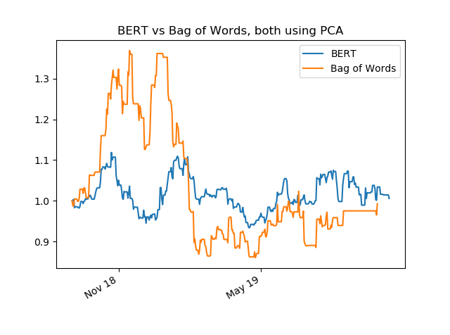
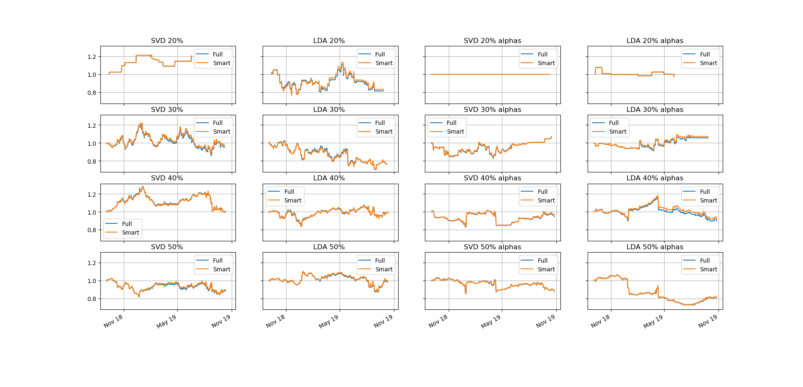
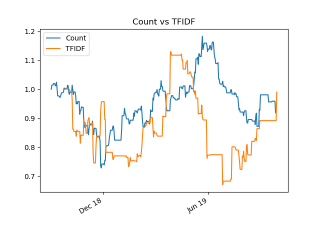
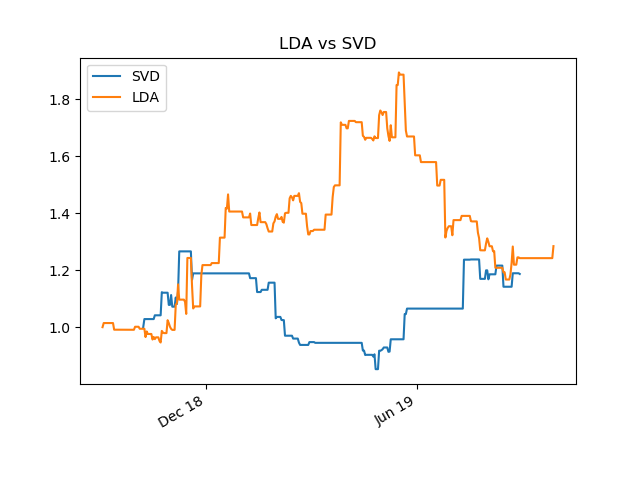
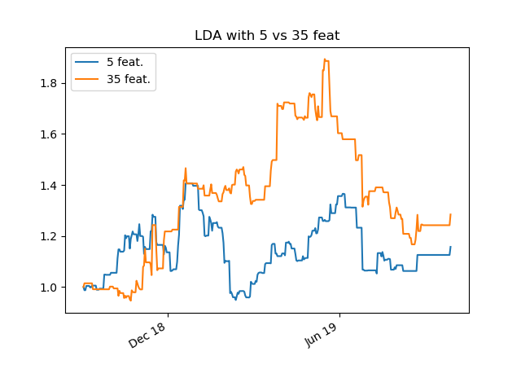
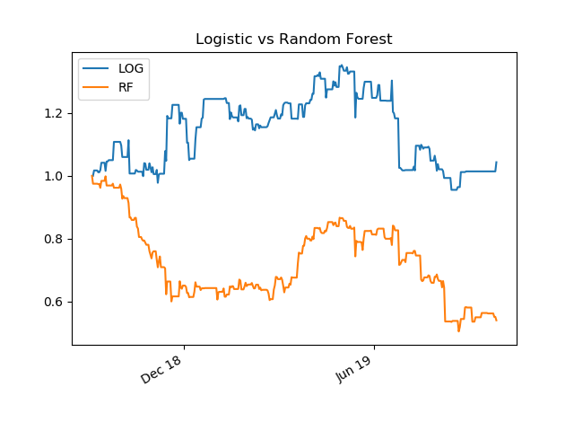

# NLP Strategy Overview
Predicting returns from 8K documents using text analysis and natural language processing.

## Results
We try model with BERT features vs. BoW features (CountVectorizer).

We also try a few models/combinations:
1. __input variables__ (remove column): sentiment score (Quandl) vs. sentiment + 8K text
2. __document-term matrix__(vectorizer): CountVectorizer (bag-of-words) vs. Tf-idf
3. __dimensionality reduction__: PCA (Truncated SVD) vs. LDA
4. __Classifier__: logistic regression (SGDClassifier) vs. random forests

First, we show the out-of-sample PnLs for these models.

BERT features give a less volatile strategy.

Below are plots comparing SVD(PCA) to LDA using different levels of discretization for training.

The left two columns show the models trained and tested on the full returns.  20% means the returns were categorized into 80th percentile (for buys) and 20th percentile (for sells).  Likewise, 30% means 70th and 30th percentiles, etc.

The right two columns are the same models, but trained on only the alphas of the returns; The SP500 beta was subtracted from each return before training, and the PnL's show what would happen if the market beta was hedged out for each trade.

The following plots are of various binary comparisons.

CountVectorizer performs slightly better than Tf-idf.

LDA performs better than SVD (PCA), contrary to the f1_weighted scores, which
will be shown below.

Here, more features performs better, indicating that overfitting did not occur.

Logistic regression clearly beats random forests by PnL, which will be 
supported again below with the ML-performance scores (f1_weighted).

Next, we show the performance of the ML-classifiers which form this strategy.

rem_col|vect|dim_red|clf|split0_test_score
---|---|---|---|---
drop_column|CountVectorizer|LatentDirichletAllocation|RandomForestClassifier|0.383
||||SGDClassifier|0.416
|||TruncatedSVD|RandomForestClassifier|0.383
||||SGDClassifier|0.408
||TfidfVectorizer|LatentDirichletAllocation|RandomForestClassifier|0.383
||||SGDClassifier|0.411
|||TruncatedSVD|RandomForestClassifier|0.383
||||SGDClassifier|0.41
use_text_col|CountVectorizer|LatentDirichletAllocation|RandomForestClassifier|0.412
||||SGDClassifier|0.418
|||TruncatedSVD|RandomForestClassifier|0.424
||||SGDClassifier|0.479
||TfidfVectorizer|LatentDirichletAllocation|RandomForestClassifier|0.42
||||SGDClassifier|0.438
|||TruncatedSVD|RandomForestClassifier|0.429
||||SGDClassifier|0.47

These results select the model with the maximum score (`f1_weighted`) over the 
hyperparameter grid, using a `pandas` `groupby`. The hyperparameter grid can 
be found [here](ey_nlp/build_model_ml_models.py). This table can be found in 
`data/res_ml_models.md` and was created by running 
`python ey_nlp/performance_ml_models.py`.

Some patterns emerge:
1. Using the text column (i.e. the 8K text) as input features clearly improves
performance over using the FinSent sentiment score only.
2. Logistic regression clearly outperforms random forests.
3. CounterVectorizer and TfidfVectorier are mixed; neither consistently
outperforms the other.
4. PCA outperforms LDA when the text data is used, which is the important case 
(LDA is obviously not performed when there is no text input).

Next, we simplify the model based on the best-performing choices from above,
and add in a new set of features that are the last hidden layer of the 
non-fine-tuned BERT embeddings.

B-o-W|BERT|f1_weighted
---|---|---
drop_BOW_feat|drop_BERT_feat|0.439
||use_BERT_feat|0.454
use_BOW_feat|drop_BERT_feat|0.481
||use_BERT_feat|0.462

The sentiment feature serves as our baseline and is present in all four models.
In the first row, the model uses neither BOW nor BERT, only the sentiment 
feature. Adding BERT features increases the score (second row). Next, adding
the BOW features only increases the score even more (third row). Finally, using
both BOW and BERT features is higher than using neither but lower than adding
BOW alone. These results show that BOW features outperform the BERT features.

The result that using both BOW and BERT features performs worse than only BOW
is a case of overfitting. Using too many input variables can cause overfitting
and removing variables is a type of regularization. Note that these are _machine
learning_ performance measures, not _investment strategy_ performance measures.
A model with poor prediction could actually make moeny; a well-predicting model
could lose money. The two measures generally go together but not always.

### Correlation Between Topics and Sentiment/Alpha Score
Sentiment Score has range from 5 to -5. Here we define large positive sentiment score as score larger than 3 and small negative sentiment score as scores that are smaller than -3. Recall that for alpha score we have 0 represents large downside movement, 1 represents no significant movement and 2 represents large upside movement. 

Correlation between topics and sentiment scores

## Setup
This setup assumes you already have `conda` and `git` installed.
1. Clone this repo at your terminal: `git clone https://github.com/hatemr/NLP-for-8K-documents.git`
2. Create the conda environment: `conda env create -f environment.yml`
3. Activate the environment: `conda activate ey-nlp`

## Data Preparation
1. Download 8K documents from today's S&P 500 companies for the past 5 years.
2. Extract the useful text from the html documents.
3. For models using the document-term matrix (CountVectorizer or TfidfVectorizer),
the 8K text needs preprocessing:
    * From `/ey-nlp` run `python ey_nlp/preprocessing.py`. This creates a copy.
    * remove proper nouns (Apple), make lower case (The -> the), expand contractions (can't -> cannot), remove special characters and digits ('[^a-zA-z0-9\s]'), remove stopwords (a, the), remove html tags (`

`), remove accented characters, remove newlines ([\r|\n|\r\n]+), remove extra whitespace
    * Tokenize text:
      *lemmatize, stemmer

Now the text is ready to be turned into the document-term matrix.

For BERT, we extract sentence embeddings , obtained using the library `transformers` \
from [Hugging Face](https://github.com/huggingface/transformers). The embeddings
are the last layer of the non-fine-tuned BERT neural network. Instructions
on extracting embeddings can be found [here](https://huggingface.co/transformers/quickstart.html)
 and [here](https://mccormickml.com/2019/05/14/BERT-word-embeddings-tutorial/).

Now the text is ready to 
5. Vectorize to a document-term matrix using `CountVectorizer`.
    * All our models require creating the document-term matrix. However, we 
  might later try models that use another vectorizer (e.g. tf-idf).

## Target Variable
Our target variable is each companies' daily alpha, computed using the market
return. The market correlation, beta, is computed using the prior XXX weeks 
returns of the company. The alphas are discretized to obtain a multiclass 
classification problem: less than -0.01 is 0, -0.01 to 0.01 is 1, and greater
than 0.01 is 2. 

We also tried this approach applied to raw returns, instead of alpha. However,
we switched to alpha so our strategy would be independent of the overall market
performance.

We also tried using a binary classification where we split returns at 0, but we
decided that predicting _large_ movements was more likely to give a profitable
strategy.

## Data Splitting
  
| dataset       | dates             | n_samples     | indices     |
| ------------- | ----------------- | ------------- | ----------- |
| train         | 1/2/15 - 7/31/17  | 9947 (52%)    | 0:9947      |
| validate      | 7/31/17 - 8/31/18 | 4852 (25%)    | 9947:14799  |
| test          | 9/1/18 - 10/25/19 | 4284 (23%)    | 14799:19083 |
| total         | 1/2/15 - 10/25/19 | 19083 (100%)  | 0:19083     |
  
## Modeling
Our strategy varies along a few dimensions.

1. __Document-term matrix__: CountVectorizer, tf-idf
2. __Dimensionality reduction__: PCA, LDA (HLDA was considered but discarded in
 the interest of time. We considered SESTM [(Ke et. al. 2019)](references/Predicting_Returns_with_Text_Data.pdf)
 but did not try it because the model needs news article data, not 8Ks.
3. __Horizon__: 1 (we have more but did not try them: 2, 3, 5, 10, 20, 30 days)
4. __Model__: logistic regression, random forests

## Scoring metric: f1_weighted
We use the scoring metric `f1_weighted` from `sklearn` on the validation set for 
model selection. I chose this metric because it seemed the simplest and most
common metric available in sklearn for the multiclass setting. `f1_weighted` computes
the f1 score for each class of the target variable, then takes the weighted 
mean over classes. The weight is the number of true instances of the class. This
helps account for class imbalance by giving greater weight to higher-frequency
classes.

One idea is to change the scoring metric to our own PnL calculation. However,
we seek to compare different NLP techniques with each other, not create a 
realistic investment stategy. Therefore, we stick with _f1_weighted_.

### LDA for Topic Modeling
Latent Dirichlet Allocation (LDA) aims to model documents as arising from multiple topics, where a _topic_ is defined to be a distribution over a fixed vocabulary of terms. Each document exhibits these topics with different proportions. The K topics and their relative weights are treated as hidden variables. Given a collection of documents, the _posterior distribution_ of the hidden variables given the observed documents determines a hidden topical decomposition of the collection.

## LDA Topic Explanation
* __Topic 1__: structuring change in the company’s management level: appointment of new CEO/ change in the committee
* __Topic 2__: new financial statement: assessment about tax/new acquisition
* __Topic 3__: recent press release about operations and financial statement
* __Topic 4__: expectations about earnings in the upcoming quarters
* __Topic 5__: recent earnings of the company and acquisition/ collaboration agenda.
* __Topic 6__: board of director member change
* __Topic 7__: vote for shareholders and appointment of public audit company
* __Topic 8__: amendment of agreement(all different agreement)
* __Topic 9__: realease Results of Operations and Financial Condition
* __Topic 10__: regulation FD disclosure and struction change of orginization

We classified all documents into different topics based on its highest probability across all topics. And by the similarity of its different text informatio, we extracted and summarized above as the explanation for each topic. 
(All topics are sentimental-neutral)

* LDA in sklearn: [here](https://scikit-learn.org/stable/modules/decomposition.html#latent-dirichlet-allocation-lda)

### Resources
* [Topic Models (Blei and Lafferty)](http://citeseerx.ist.psu.edu/viewdoc/download?doi=10.1.1.186.4283&rep=rep1&type=pdf)
* [Hierarchical Dirichlet Processes (gensim)](https://www.stat.berkeley.edu/~aldous/206-Exch/Papers/hierarchical_dirichlet.pdf)
