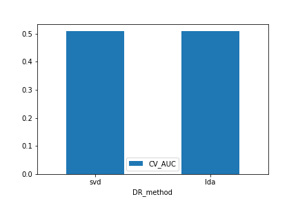
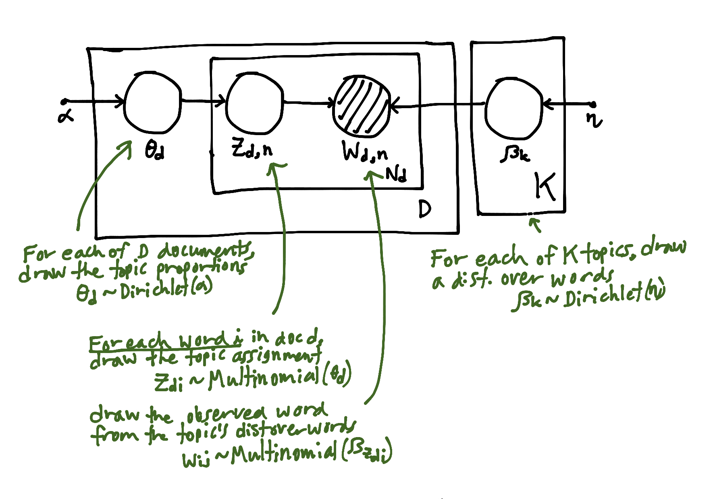

# NLP Strategy Overview
Predicting returns from 8K documents using text analysis and natural language processing.

## Setup
This setup assumes you already have __conda__ and __git__ installed.
1. Clone this repo at your terminal by running `git clone https://github.com/hatemr/NLP-for-8K-documents.git`
2. Create the conda environment by running `conda env create -f environment.yml`
3. Activate the environment: `conda activate ey-nlp`

## Results
Let's show the most interesting part first. This plot compares cross-validation AUC for two methods of dimensionality reduction: the SVD (PCA) and LDA. The two are close, and both very close to random guessing (0.5).

## Data Preparation
1. Download 8K documents from today's S&P 500 companies for the past 5 years.
2. Extract the useful text from the html documents.
3. Clean text: 
    * From `/ey-nlp` run `python ey_nlp/preprocessing.py`. This creates a copy.
    * remove proper nouns (Apple), make lower case (The -> the), expand contractions (can't -> cannot), remove special characters and digits ('[^a-zA-z0-9\s]'), remove stopwords (a, the), remove html tags (`

`), remove accented characters, remove newlines ([\r|\n|\r\n]+), remove extra whitespace
4. Tokenize text:
    * lemmatize, stemmer
5. Vectorize to a document-term matrix using `CountVectorizer`.
    * All our models require creating the document-term matrix. However, we 
  might later try models that use another vectorizer (e.g. tf-idf).
  
## Modeling
The key step in our strategy is to turn the document-term matrix into a
lower-dimensional representation. We try a few approaches:
1. PCA
2. LDA
3. SESTM [(Ke et. al. 2019)](references/Predicting_Returns_with_Text_Data.pdf)

### LDA for Topic Modeling
Latent Dirichlet Allocation (LDA) aims to model documents as arising from multiple topics, where a _topic_ is defined to be a distribution over a fixed vocabulary of terms. Each document exhibits these topics with different proportions. The K topics and their relative weights are treated as hidden variables. Given a collection of documents, the _posterior distribution_ of the hidden variables given the observed documents determines a hidden topical decomposition of the collection.

* LDA in sklearn: [here](https://scikit-learn.org/stable/modules/decomposition.html#latent-dirichlet-allocation-lda)

### Resources
* [Topic Models (Blei and Lafferty)](http://citeseerx.ist.psu.edu/viewdoc/download?doi=10.1.1.186.4283&rep=rep1&type=pdf)
* [Hierarchical Dirichlet Processes (gensim)](https://www.stat.berkeley.edu/~aldous/206-Exch/Papers/hierarchical_dirichlet.pdf)